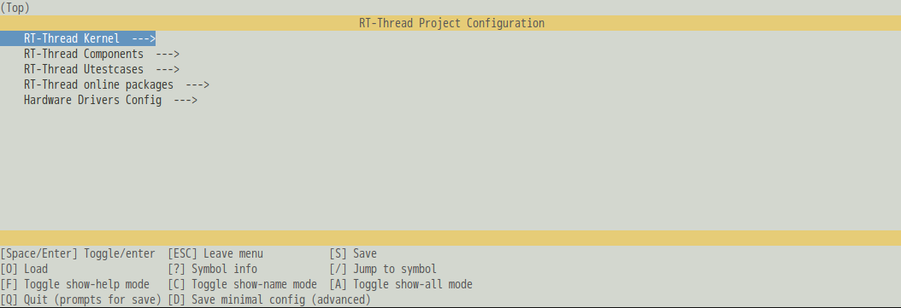

# env

Command line tool to assist RT-Thread development

This project is modified from RT-Thread's [env](https://github.com/RT-Thread/env) script

Mainly modified the following points:

* Use python's [Kconfiglib](https://github.com/ulfalizer/Kconfiglib) and its menuconfig interface to replace the original [kconfig-frontend](http://ymorin.is-a-geek.org/projects/kconfig-frontends).The purpose of this was originally to make the scripts under rt-thread/tools more refreshing, and to use python to expand more easily, or to combine with other tools.
* The original env script, the function of menuconfig, and SCons are combined into one command line tool and packaged in the format of python wheel.The purpose of this is to install and use env in a consistent way on different platforms.

## How to install

It has not been released to python's PyPi yet, so it needs to be installed by the following command

``` shell
    pip install .env-0.1.0-py3-none-any.whl
```

## How to use

First, you need to execute the following command to pull the package index of rt-thread to the local

```shell
    rtt pkgs init
```

After that, it can be used normally in a BSP directory.

For example, use menuconfig with the following command

```shell
    rtt menuconfig
```
